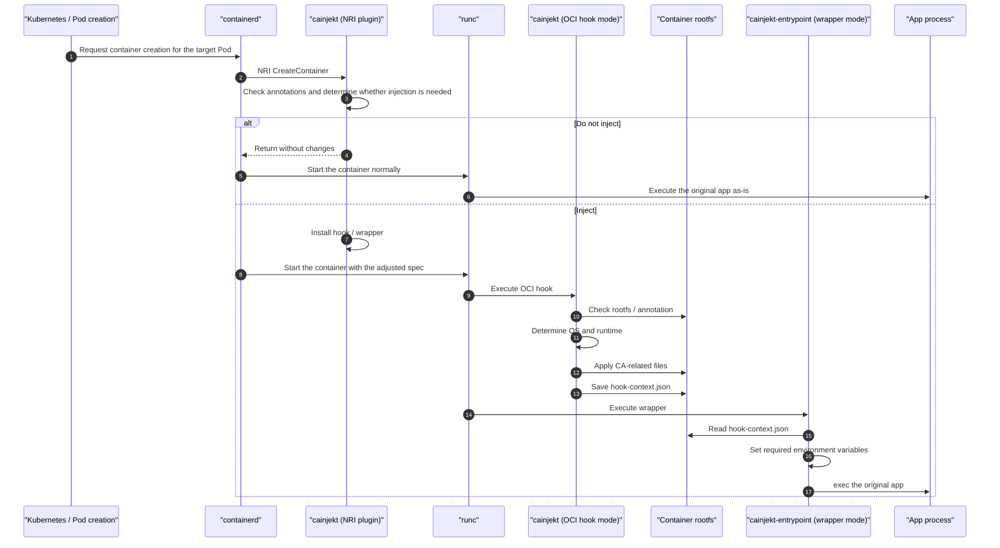

## Overview

`cainjekt` is a mechanism for injecting a custom CA into containers without depending on the OS or language runtime, and it operates in the following three modes:

- NRI plugin mode
- OCI hook mode
- wrapper mode

## Role Of Each Mode

### NRI plugin mode

In NRI plugin mode, `cainjekt` determines whether CA injection should be applied to the target Pod and modifies the container startup configuration so that the subsequent processing can run.

It mainly performs the following:

- Check Pod annotations to determine whether the Pod is subject to CA injection
- Stage the CA bundle
- Add configuration to execute the OCI hook
- Replace the container startup command so that it goes through the wrapper

### OCI hook mode

In OCI hook mode, `cainjekt` inspects the rootfs before the container starts and performs preprocessing according to the OS and language runtime.

It mainly performs the following:

- Obtain the rootfs from the OCI bundle and spec
- Determine the OS and language runtime based on the rootfs
- Reflect the CA into the OS trust store
- Save the result inside the container as `hook-context.json`

This is because the rootfs can only be accessed at the OCI hook layer.

### wrapper mode

In wrapper mode, `cainjekt` reads the information saved by OCI hook mode, sets environment variables as needed, and then starts the original entrypoint.

It mainly performs the following:

- Read `hook-context.json`
- Rewrite CA-related environment variables according to the language runtime
- Execute the original entrypoint with `syscall.Exec`

This is because, for some language runtimes such as Node.js and Python, specifying the CA path through environment variables is the most reliable approach, so those environment variables need to be set at startup.

## Overall Flow

